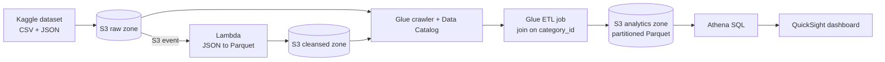

# YouTube Trending Video Analytics on AWS (End to End)

A serverless data lake on AWS for analyzing trending YouTube videos across regions. It ingests raw CSV and JSON data, cleans and converts it to Parquet, catalogs it, joins it with an ETL job, and makes it queryable with SQL and dashboards.

## Architecture

## Dataset

Daily statistics for trending YouTube videos (up to 200 per day) across the US, GB, DE, CA, JP, IN and FR regions: [Kaggle: Trending YouTube Video Statistics](https://www.kaggle.com/datasets/datasnaek/youtube-new).

- Per-region CSV files: title, channel, publish time, tags, views, likes, dislikes, comment count, and more.
- Per-region JSON files mapping `category_id` to category names.

## How it works

1. **Ingest:** raw CSV and JSON files are uploaded to S3, partitioned by region ([`amazon_s3_cli_commands.sh`](amazon_s3_cli_commands.sh)).
2. **Catalog:** Glue crawlers infer schemas and register tables in the Glue Data Catalog.
3. **Clean (event-driven):** an S3-triggered Lambda ([`lambda_function.py`](lambda_function.py)) flattens the nested category JSON with pandas, writes it as Parquet with AWS Data Wrangler to a cleansed bucket, and updates the catalog.
4. **Transform:** Glue ETL jobs ([`de_youtube_etl_csv_to_parquet.py`](de_youtube_etl_csv_to_parquet.py), [`de_youtube_parquet_analytics_version.py`](de_youtube_parquet_analytics_version.py)) convert the CSVs to Parquet, join video statistics with categories on `category_id`, and write a partitioned analytics table.
5. **Analyze:** query with Athena and visualize in QuickSight.

## Tech

AWS S3 · Lambda · Glue (crawlers, Data Catalog, ETL) · Athena · QuickSight · IAM · Python · PySpark · Parquet

## Acknowledgements

This project was built by following an existing end-to-end AWS tutorial, and its README was adapted from [chayansraj/Youtube-video-data-analytics-using-AWS](https://github.com/chayansraj/Youtube-video-data-analytics-using-AWS).
